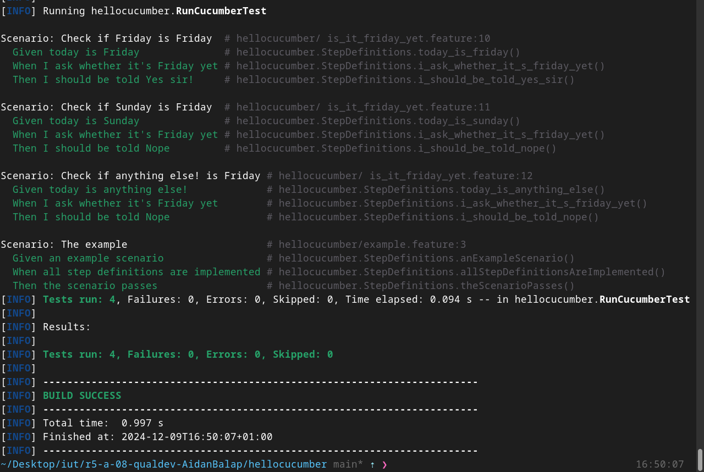

= R5.A.08 -- Dépôt pour les TPs
:icons: font
:MoSCoW: https://fr.wikipedia.org/wiki/M%C3%A9thode_MoSCoW[MoSCoW]

Ce dépôt concerne les rendus d' mailto:aidan.balasch-perez@etu.univ-tlse2.fr[Aidan Balasch Pérez].

== TP1

.is_it_friday_yet.feature
```Gherkin
Feature: Check if today's Friday

    Scenario: Check if <day> is Friday
        Given today is <day>
        When I ask whether it's Friday yet
        Then I should be told <answer>

        Examples:
            | day            | answer   |
            | Friday         | Yes sir! |
            | Sunday         | Nope     |
            | anything else! | Nope     |
```

.Exemple d'image insérée en asciidoc


== TP2 ...

### TODO