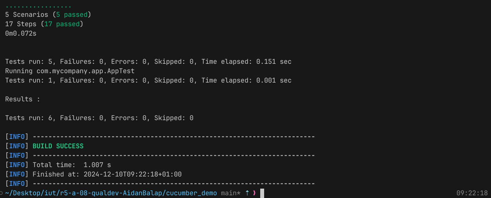

= R5.A.08 -- Dépôt pour les TPs
:icons: font
:MoSCoW: https://fr.wikipedia.org/wiki/M%C3%A9thode_MoSCoW[MoSCoW]

Ce dépôt concerne les rendus d' mailto:aidan.balasch-perez@etu.univ-tlse2.fr[Aidan Balasch Pérez].

== TP1

.hellocucumber/src/resources/hellocucumber/is_it_friday_yet.feature
```Gherkin
Feature: Check if today's Friday

    Scenario: Check if <day> is Friday
        Given today is <day>
        When I ask whether it's Friday yet
        Then I should be told <answer>

        Examples:
            | day            | answer   |
            | Friday         | Yes sir! |
            | Sunday         | Nope     |
            | anything else! | Nope     |
```

image::./docs/tp1-test-results.png[width=80%]

== TP2

.cucumber_demo/src/main/java/dojo/Order.java
```java
package dojo;

import java.util.ArrayList;
import java.util.List;

public class Order {
    private String orderAuthor;
    private String orderTarget;
    private String message;
    private ArrayList<String> cocktailsOrdered = new ArrayList<String>();

    public void declareOwner(String orderAuthor) {
        this.orderAuthor = orderAuthor;
    }

    public void declareTarget(String target) {
        this.orderTarget = target;
    }

    public List<String> getCocktails() {
        return cocktailsOrdered;
    }

    public void addMessage(String message) {
        this.message = message;
    }

    public String getMessage() {
        return "From " + orderAuthor + " to " + orderTarget + ": " + message;
    }
}
```




== TP3

## TODO